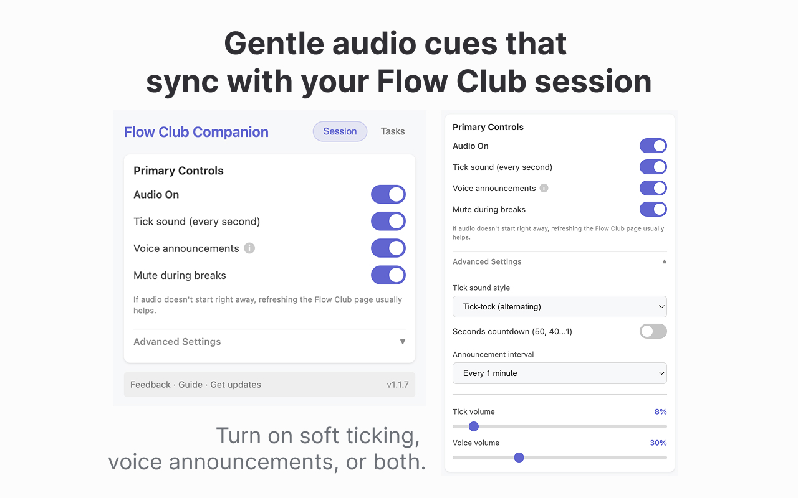
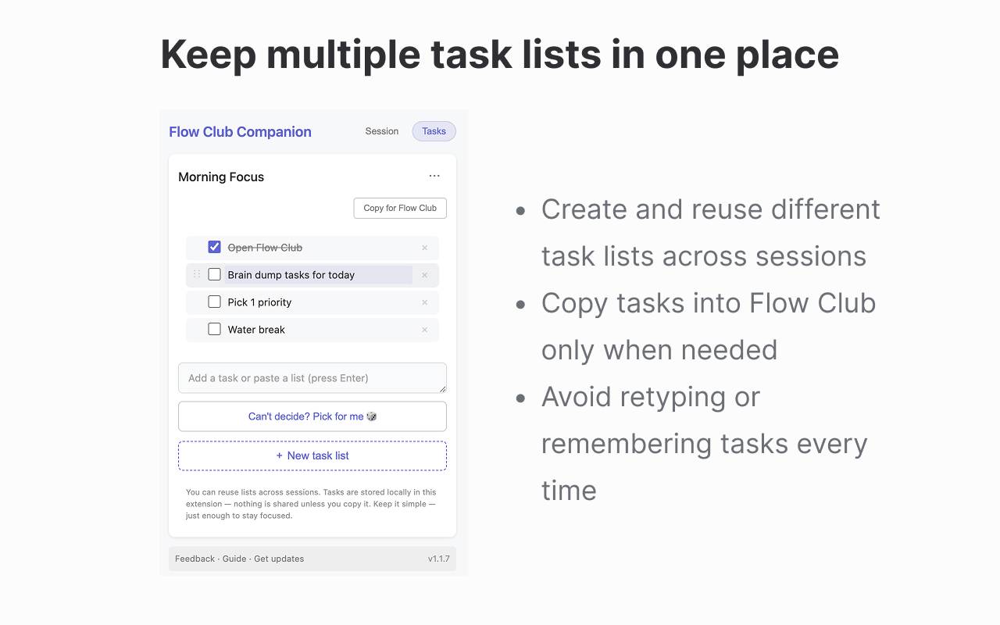

# Flow Club Companion · Browser Extension

> "…we've loved seeing some of you hack together your own customizations — from Liddy's extension that adds ticking sounds…"
> — Ricky Yean, co-founder of Flow Club

A browser extension that adds ambient audio cues and lightweight task management to Flow Club sessions — helping users stay time-aware without interrupting their focus.

**~100 active users · Chrome + Firefox · Built solo (design + engineering)**

[Case Study](https://www.lydiakwag.com/projects/flow-club-companion) · [Install](https://www.lydiastud.io/flow-club-companion)

> Unofficial community tool, not affiliated with Flow Club.

---

## Why I built this

Flow Club provides real structure — shared start times, defined durations, people working alongside you. But structure alone doesn't solve attention drift.

As a 400+ hour Flow Club user, I kept losing track of the session in both directions: sometimes too absorbed to notice the timer, sometimes drifted entirely away from it. The on-screen timer only helps if you stop and look at it.

I built Flow Club Companion to provide ambient time awareness — cues that reach you without requiring visual attention.

---

## Screenshots





---

## Features

| Feature | Description |
|---|---|
| Tick sounds | Soft metronome every second — time you can hear, not just watch |
| Voice announcements | Spoken time updates at configurable intervals (1, 2, 3, 5, or 10 min) |
| Seconds countdown | Optional final-seconds alerts so session endings feel deliberate, not abrupt |
| Transition cues | Audio tone on any phase change (lounge → session, focus ↔ break) |
| Task lists | Reusable session task lists with two-way sync to Flow Club's native Goals panel |
| Per-user config | Volume, frequency, cue type — all adjustable; defaults tuned to help without intruding |

---

## Technical Highlights

**Cross-browser without a shared codebase.**
Chrome (Manifest V3) and Firefox Add-on maintained in parallel. Two meaningfully different extension APIs, two separate publishing pipelines — shipped and updated independently with minimal divergence.

**DOM observation without an official API.**
Flow Club provides no public extension API. I used `MutationObserver` to watch the session timer directly from the DOM — resilient observation of what the page renders, parsed from MM:SS and HH:MM:SS formats. A grace period (`timerMissingCount`) handles React re-renders without false phase transitions.

**Audio system built from scratch.**
Web Audio API for tick sound generation with independent volume control. Web Speech API for spoken time announcements at configurable intervals. Both systems designed to be calm rather than alarming; audio is off by default.

**Fully local, zero dependencies.**
All audio assets bundled. No external services, no analytics, no data sent anywhere. `chrome.storage.local` / `browser.storage.local` for persistence.

---

## Architecture

```
manifest.json / manifest.firefox.json   # Browser-specific extension configs (MV3)
flowclub.content.js                     # Content script — MutationObserver, timer parsing, audio engine
popup.html / popup.js                   # Extension UI: Session / Tasks tabs
browser-api.js                          # Cross-browser shim (chrome.* / browser.*)
audio/
  effects/    tick1.mp3, tok1.mp3, ding.mp3, chime.mp3
  minutes/    m01.mp3 – m25.mp3
  seconds/    s01–s09, s10, s20, s30, s40, s50.mp3
```

**Storage:** `chrome.storage.local` / `browser.storage.local`
**Permissions:** `storage`, `host_permissions: https://in.flow.club/*`

---

## The Hard Part: Platform Governance as a Product Risk

During development, the Chrome Web Store account associated with the extension was flagged and revoked — removing the extension from the store and disconnecting ~100 active users overnight.

I rebuilt: established a dedicated developer account with cleaner publishing practices, republished under the new account, and continued shipping updates without interrupting Firefox users throughout the transition.

The lesson: platform governance is part of the product lifecycle, not an afterthought. I now treat account hygiene and distribution risk the same way I treat any other technical dependency.

---

## Getting Started

```bash
git clone https://github.com/lydiacodesdaily/flow-club-companion-focus-audio.git
cd flow-club-companion-focus-audio
```

**Chrome:**
1. Navigate to `chrome://extensions/`
2. Enable Developer mode
3. Click **Load unpacked** → select this folder

**Firefox:**
Install via [Mozilla Add-ons](#) or load temporarily via `about:debugging`.

> Audio cues are off by default. Refresh the Flow Club page once after enabling them.

Full setup guide (with screenshots): [Notion guide](https://www.notion.so/Flow-Club-Companion-Getting-Started-Guide-2e1663a03246802981dae232646d88eb)

---

## Privacy

- Runs entirely in your browser
- Only operates on `https://in.flow.club/*`
- All data stored locally in the extension
- No data sent to external servers
- No analytics or activity tracking

---

## Built by

**Lydia Kwag** — Senior Front-End & Product Engineer
[lydiakwag.com](https://www.lydiakwag.com) · [lydiacodesdaily](https://github.com/lydiacodesdaily)

Also building: [FlowMate](https://www.lydiakwag.com) — a standalone cross-platform focus timer (React Native, 1,000+ users)
